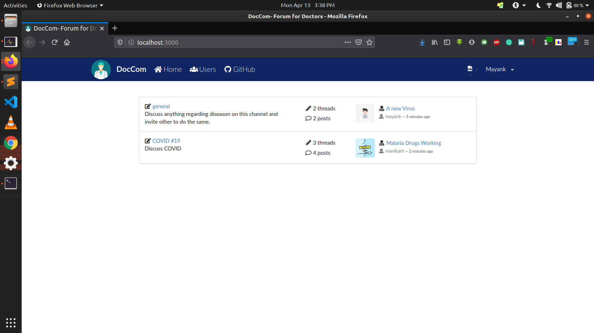
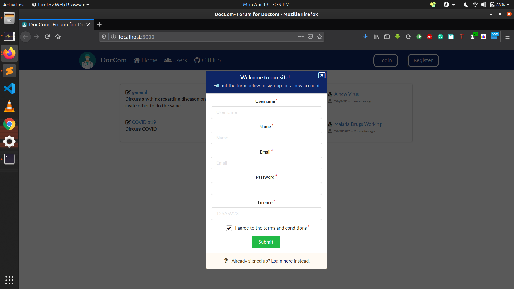
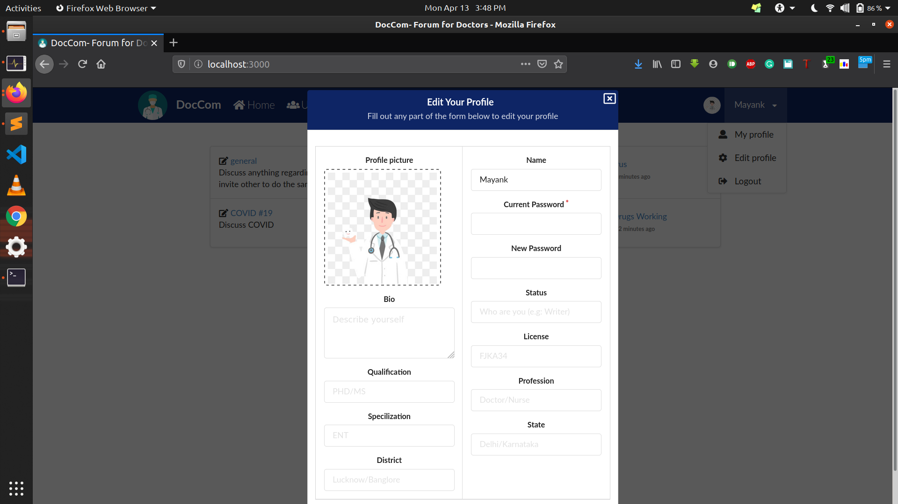
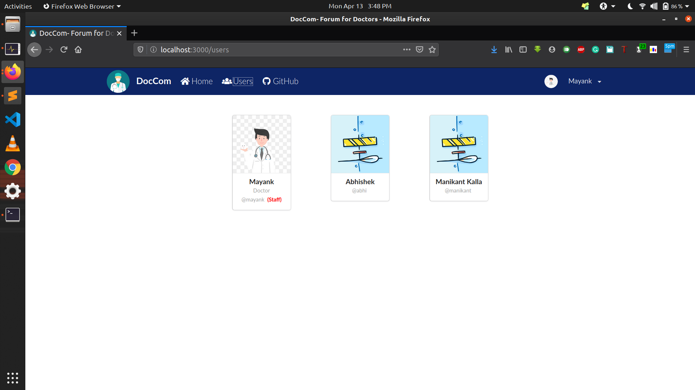
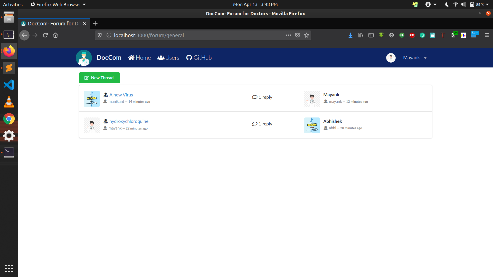
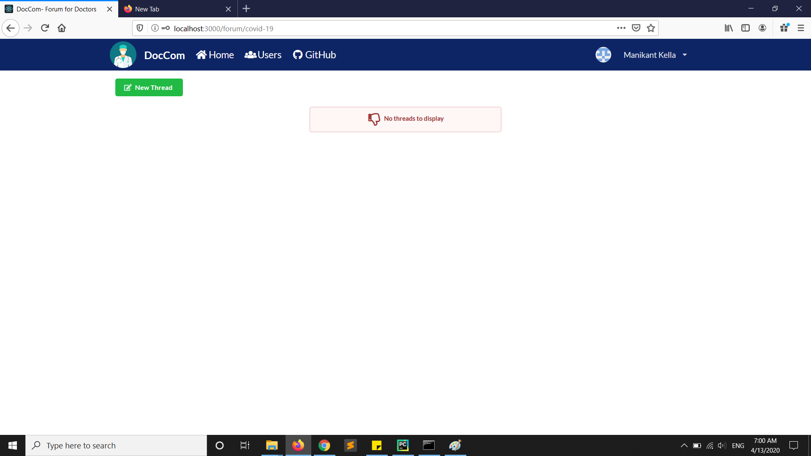
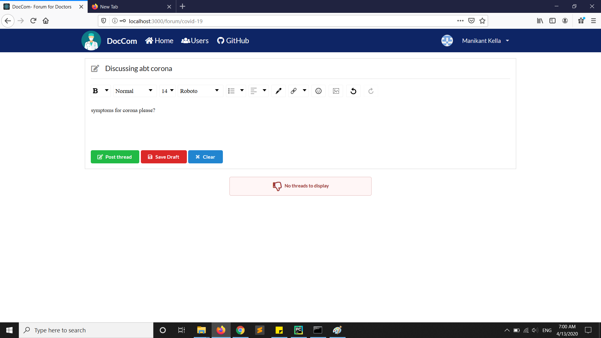
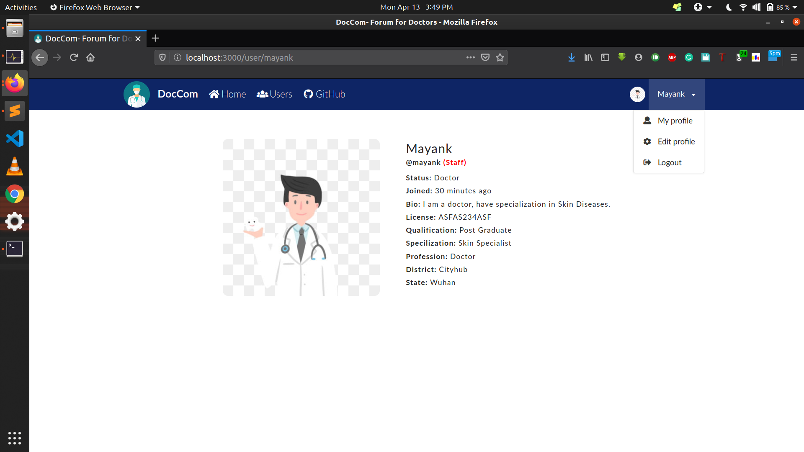
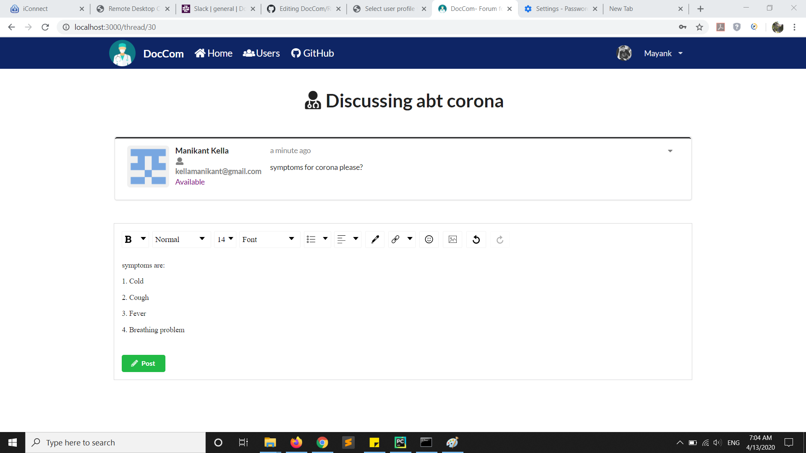

# DocCom
A forum application built for Doctors to come up and discuss issues related to Covid-19 happening in India, users can sign up and post questions and can answers to questions as well. In this critical situation of Covid-19 in India, having a community especially for Doctors helps for patience. Hope this helps Doctors during Covid-19 in India.

## Frontend
> The frontend is a fast, interactive and simple Single-Page-Application (SPA), written in ES6 Javascript and built with following technologies:
> * [React](https://facebook.github.io/react/)
> * [Redux](http://redux.js.org/)
> * [React Router](https://github.com/ReactTraining/react-router)
> * [Redux Thunk](https://github.com/gaearon/redux-thunk)
> * [Redux Persist](https://github.com/rt2zz/redux-persist)

### Demo Screenshots:










## Backend
> The backend is a scalable system that provides data through its RESTful API (browseable API available), written in Python and built with following technologies:
> * [Django](https://www.djangoproject.com/)
> * [Djangorestframework](http://www.django-rest-framework.org/)

## API endpoint
```
List of available API (browseable) at /api
* /user/
* /user/login/
* /user/register/
* /user/logout/
* /user/{username}/
* /user/{username}/edit
* /user/{username}/delete
* /forum/
* /forum/create/
* /forum/{slug}/
* /forum/{slug}/edit/
* /forum/{slug}/delete/
* /thread/
* /thread/create/
* /thread/{id}/
* /thread/{id}/edit/
* /thread/{id}/delete/
* /post/
* /post/create/
* /post/{id}/
* /post/{id}/edit/
* /post/{id}/delete/
```

## Installation

Make sure you have following software installed in your system:
* Python 3
* Node.js
* NPM / Yarn
* Git

First, we need to clone the repository
```
git clone https://github.com/may55/DocCom.git
```

Install all required dependencies in an isolated environment

```
cd DocCom/backend
python3 -m venv venv
source venv/bin/activate
pip install -r requirements.txt
```

Copy the `.env.example` as `.env` in `backend` folder
```
cp .env.example .env
```

Install all required dependencies for frontend in DocCom/frontend folder by typing
```
cd ../frontend
yarn
```

Copy the `.env.example` as `.env` in `frontend` folder
```
cp .env.example .env
```

## Running Backend on Local Server

Activate virtual environment

```
cd backend
source venv/bin/activate
```

(Optional) Run test
```
python manage.py test
```

Then run the server, api endpoint should be available on http://localhost:8000/api

```
python manage.py runserver
```

## Running Frontend on Local Server

Start development server

```
cd frontend
yarn start
```

Frontend should be available on http://localhost:3000/

### Test User
By default, the database for development server in `backend/db.sqlite3` is already filled with some data for ease of development. The superuser id is `irene` and password is `irene` as well.

If you want to start clean. Delete `db.sqlite3` and follow this step in `backend folder`
```py
python manage.py makemigrations
python manage.py migrate
python manage.py createsuperuser
```
